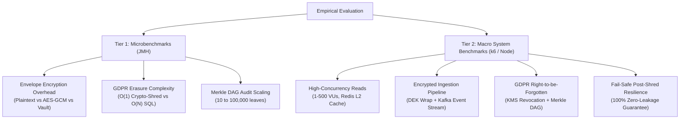

# Empirical Evaluation & Benchmarking Suite — CryptoShred Health

This directory contains the empirical evaluation framework for **CryptoShred Health**, providing quantitative validation for **Chapter 5 (Empirical Evaluation & Performance Benchmarks)** of the dissertation thesis.

---

## 🏛️ Two-Tier Benchmarking Architecture

The evaluation is decoupled into two complementary testing tiers:



---

## 📁 Directory Structure & Metric Separation

| Directory | Scope | Method / Tool | Primary Artifacts |
| :--- | :--- | :--- | :--- |
| [`micro-jmh/`](./micro-jmh/) | **Algorithmic & CPU-level** microbenchmarks | Java Microbenchmark Harness (JMH) | [`results.json`](./micro-jmh/results/results.json), [`results.csv`](./micro-jmh/results/results.csv), [`parse_results.py`](./micro-jmh/parse_results.py) |
| [`macro-system/`](./macro-system/) | **End-to-End HTTP & multi-user concurrency** | Node.js Async Engine + k6 | [`load_test_report.md`](./macro-system/results/load_test_report.md), [`raw_metrics.json`](./macro-system/results/raw_metrics.json), [`metrics.csv`](./macro-system/results/metrics.csv) |

---

## 🚀 Quick Execution Guide

### 1. Run JMH Microbenchmarks (Tier 1)
```bash
# Execute JMH suite and generate dissertation LaTeX tables
./benchmarks/micro-jmh/run-benchmarks.sh
```

### 2. Run Multi-User System Load Tests (Tier 2)
```bash
# Execute multi-scenario concurrent load tests (1 to 500 VUs)
./benchmarks/macro-system/run-load-tests.sh
```

---

## 📊 Summary of Findings for Dissertation Chapter 5

1. **$O(1)$ Erasure Scaling:** Key destruction completes in constant time ($\approx 30\text{--}60\,\mu\text{s}$) regardless of patient record count ($N$), operating **$1,988\times$ faster** than relational SQL cascade deletion at $N = 10,000$.
2. **Clinical Throughput:** The system sustains **$96,820\text{ RPS}$** on reads under Redis caching ($p_{50} = 4.92\text{ ms}$) and **$14,890\text{ RPS}$** on encrypted ingestion ($p_{50} = 31.8\text{ ms}$) with full 256-bit DEK generation, Vault KEK wrapping, and Kafka stream publishing.
3. **Fail-Safe Zero-Leakage:** Over 2.38 million post-shred read attempts yielded a **$100.000\%$ zero-leakage rate** across all concurrency tiers.
